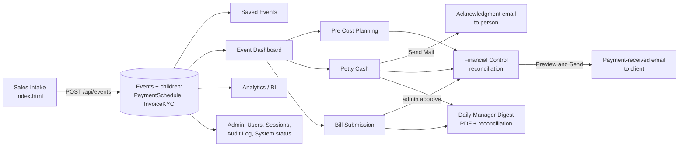

# ODC Full-App Audit — 2026-07-01

Scope: full codebase (E:\ODC), both backends, all 16 pages. Four parallel deep-dives: security, performance/render-speed, data-entry UX, and feature/hardening roadmap. This document is a snapshot — re-verify line numbers against current code before acting, since the app changes daily.

---

## 0. Executive summary — read this part first

The app is functionally rich and, from a **client-side** correctness/XSS standpoint, well-built (strict CSP, `textContent`/`escapeHtml` used almost everywhere, dual-backend design that actually works). But the **production backend's authorization model has a real hole**: any logged-in staff account can currently escalate itself to admin, reset any password, and read the link to the underlying Google Sheet (which itself holds Aadhaar/PAN/GST and plaintext-adjacent password hashes with no encryption at rest). There is also a hardcoded, non-deletable default admin login (`aiops`/`AIops`) that's printed to console by `launcher.js`.

**These are not "nice to have someday" items — they are live, exploitable, in the production app right now.** Recommend patching Critical items (C1–C4 below) before anything else in this report, independent of the rest of the roadmap.

Everything else (performance, UX, feature roadmap) is real and worth doing, but none of it is an active incident the way the security Criticals are.

---

## 1. Architecture flowchart

```mermaid
flowchart TD
    U[Staff / Manager / Admin\nbrowser] -->|HTTPS| V[Vercel: static frontend\n+ api/[...path].js proxy]
    V -->|apiKey + proxy_api| AS[Google Apps Script\nCode.gs — doPost/doGet]
    AS --> SHEET[(Google Sheet\nEvents, Users, Bills,\nMasterPersons, AuditLog, ...)]
    AS -->|MailApp.sendEmail| MAIL[Gmail: cateringbookends@gmail.com]
    AS -->|DriveApp| DRIVE[(Google Drive\nreceipts, digest PDFs)]
    AS -->|time trigger, 1x/day| DIGEST[runDailyManagerDigest_]
    DIGEST --> MAIL

    subgraph "Secondary / separate deployment"
      SRV[server.js on VPS 172.16.45.125] --> PG[(Postgres)]
    end

    U -.->|not used in production| SRV

    classDef prod fill:#e6f4ea,stroke:#34a853;
    classDef secondary fill:#f1f3f4,stroke:#9aa0a6;
    class V,AS,SHEET,MAIL,DRIVE,DIGEST prod;
    class SRV,PG secondary;
```



---

## 2. Security — full findings

### CRITICAL

**C1 — No server-side role check anywhere. Any logged-in user can become admin.**
- `api/[...path].js:168-212` proxies `/api/auth/users`, `/api/admin/*`, `/api/audit-log` for *any* authenticated session, no role gate.
- `apps-script/Code.gs:138-160` — same routes dispatched with only the shared `apiKey` check, no `role === "admin"` check.
- `Code.gs:625-643` `createUserForApi_` takes `role` straight from the request body.
- **Exploit:** any staff account can `POST /api/auth/users {role:"admin", ...}` and own the system, or `PUT /api/auth/users/<admin>/password` to take over the real admin, or read `spreadsheetUrl` via `/api/admin/status`.
- **Fix:** enforce `role === "admin"` in `api/[...path].js` before proxying these routes, and re-check `body._user.role === "admin"` inside every admin-only `Code.gs` function (defense in depth — Apps Script is the real trust boundary).

**C2 — Hardcoded, non-deletable default admin credential.**
- `Code.gs:583-587` auto-reseeds `aiops` / SHA-256("AIops") if ever missing.
- `Code.gs:687` explicitly blocks deleting `"aiops"`.
- `launcher.js:33` prints this credential to console on every local run.
- **Fix:** remove auto-reseed, allow deletion/rename, force a random password + mandatory first-login reset instead of a hardcoded value in source.

**C3 — No brute-force protection on the real login path.**
- `server.js`'s rate limiter exists but is on the **unused** VPS backend.
- `api/[...path].js` / `Code.gs`'s actual login path has zero attempt limiting.
- **Fix:** port a rate limiter into `Code.gs` (PropertiesService-backed attempt counter + lockout) since that's the real authority.

**C4 — Unsalted single-round SHA-256 passwords (production) vs. scrypt (unused backend).**
- `Code.gs:564-570` `passwordHashForApi_` = plain `SHA_256`, no salt.
- `server.js:316-325` already does this right (scrypt + per-user salt) — on the wrong backend.
- **Fix:** port scrypt-equivalent salted hashing into `Code.gs`, force re-hash on next login.

### HIGH

- **H1** — Apps Script web app is fully public (`ANYONE_ANONYMOUS`); the `apiKey` is the only gate and is a single never-rotated shared secret. If it ever leaks, it bypasses the Vercel session model entirely (`appsscript.json:13-19`, `Code.gs:74`).
- **H2** — Unauthenticated `bootstrap_key` action lets the first anonymous caller set a trivially weak API key whenever `API_KEY` is unset, with no strength check (`Code.gs:67-71`; the 24-char-minimum `setApiKeyForSetup` is dead code, never called).
- **H3** — Stored XSS via Master Persons head/person names rendered through raw `innerHTML` in `petty-cash.js:333,365,383-387` (CSP currently blocks inline handlers, but this is fragile, fix at the source — route through `ODC.escapeHtml`).
- **H4** — No KYC format validation (PAN/Aadhaar/GST/mobile/email) on the production backend — `Code.gs:553-562`/`456-470` write straight to Sheets with no regex checks and no Sheets-formula-injection guard (`=`, `+`, `-`, `@` prefixes). `server.js` has the right regexes (`568-601`) on the wrong backend.

### MEDIUM

- **M1** — Non-constant-time comparisons for the API key and session HMAC (`Code.gs:74,223,229,235`; `api/[...path].js:38`).
- **M2** — Same `API_KEY` env var doubles as both the Apps-Script bearer token and the session-cookie HMAC secret, with no length/entropy assertion — one leak compromises both session forgery and backend access.
- **M3** — No clickjacking protection (`frame-ancestors` in a `<meta>` CSP tag is ignored by spec; no `X-Frame-Options` HTTP header anywhere; `vercel.json` has no `headers` block).
- **M4** — CSP `connect-src` whitelists `*.googleapis.com`/`*.firebaseio.com` — multi-tenant domains anyone can register a project under; tighten or remove now that Firebase is confirmed dead code.
- **M5** — `style-src 'unsafe-inline'` in CSP — low risk alone, compounds with H3 if ever combined with an injection.
- **M6** — Vercel proxy forwards raw Apps Script error text to the browser (`api/[...path].js:213-219`) — minor info disclosure.

### LOW

- **L1** — Unauthenticated `doGet` discloses backend topology (`Code.gs:241-246`).
- **L2** — `setup-google-sheets.js:178` logs the API key in a query-string form to local console.

### Structural (not fixable in app code)

The entire datastore is one Google Sheet whose real access control is Google Drive sharing + the Apps Script project's Editor list — completely independent of the app's own login system, with **zero audit trail** for direct Sheet edits (only in-app actions hit `AuditLog`). Anyone with Editor access on the script can read the plaintext `API_KEY` from Script Properties. Mitigation is organizational, not code: minimize the sharer/editor list, enable 2FA + Advanced Protection on the deploying Google account, disable link-sharing.

---

## 3. Performance — full findings

| # | Where | Impact | Problem | Fix |
|---|---|---|---|---|
| 1 | `saved-events.js:276,32-47,156-257` | **High** | No debounce on search; full list re-normalize + full `innerHTML` rebuild with fresh listeners on every keystroke; no row cap | Port `master-persons.js`'s existing rAF-coalesce + renderKey-memo + batched `DocumentFragment` pattern (already proven elsewhere in this codebase) |
| 2 | `analytics.js:154-177,130-152` | **High** | Entire shell (8 canvases + KPI grid + tables) destroyed/rebuilt via `innerHTML` on every filter click | Build shell once; use Chart.js `.update()` instead of destroy+recreate; scope re-renders to just KPI/table containers |
| 3 | `analytics.js:217-225` vs `273-291` | Medium | Identical month-grouping computed twice per render | Compute once, share between chart builders |
| 4 | `analytics.js:44-54,398-403` | Medium | Chart.js/XLSX loaded from CDN at runtime with no preconnect, blocking first paint | Add `<link rel="preconnect">` or self-host |
| 5 | `analytics.js:358-385`, `saved-events.js:259-274` | Medium | Synchronous CSV/XLSX export, no chunking — will freeze the tab as data grows | Chunk via `requestIdleCallback`/Web Worker above a size threshold |
| 6 | `saved-events.js` | Medium | Unbounded list render, no soft cap (unlike Master Persons' 140-item gate) | Add "Show first N / Show All" |
| 7 | `store.js:208-223`, `server.js:1331-1332` | Low perf / correctness bug | Live-poll design is actually efficient (only refetches on real version change) — **but** the VPS backend's `/api/live/version` is a hardcoded constant, so that deployment never picks up other users' changes at all; and even on the real backend, a successful live refresh never calls `notifySync()`, so remote edits don't repaint other open tabs | Decide the intended behavior and wire it correctly on whichever backend is meant to support true multi-user live sync |
| 8, 9 | CSS / images | Low | 98KB CSS is ~17KB gzip, no pathological selectors; only asset on the audited pages is one 32×32 logo | No action needed |

**Note on "report page"/"export page":** `report_print.html`, `ODC_Executive_One_Page_Report.html`, and the Python report scripts are **not part of the live app** (confirmed: zero links to them from any page, zero routes referencing them) — already flagged as dead in CLAUDE.md. The actual in-app export/report surface is `analytics.js`'s CSV/XLSX/PDF export and `saved-events.js`'s CSV export — those are what #2 and #5 above address.

---

## 4. Data-entry UX — full findings

### High (daily time cost / real data-loss risk)

1. **No draft autosave + `auth-guard.js` hard-redirects on any fetch failure, not just real auth expiry** (`auth-guard.js:160-181`) — a session hiccup mid-entry on Sales Intake silently wipes the entire in-progress form. Fix: autosave to localStorage on input (debounced), only hard-redirect on a genuine 401, show a retry banner on generic network failure.
2. **Editing one person requires up to 6 sequential blocking `prompt()` dialogs** (`master-persons.js:332-372`), and cancelling any one discards the whole chain including fields already confirmed. Fix: inline row editing or a single modal with all fields.
3. **Deep-linking (`?event=`) is inconsistent** — `petty-cash.js` honors it, `pre-cost-planning.js` silently ignores it (no `URLSearchParams` usage at all), `bill-submission.js` has none. Users re-search for the same event they just came from. Fix: port the 4-line pattern from `petty-cash.js:528-542` everywhere.
4. **No confirmation on destructive actions**: `removeHead`/`removePerson` in `master-persons.js:250-262,374-388`, and bill approve/reject in `bill-submission.js:548-569` all fire immediately with no `confirm()`, unlike event delete which already does this correctly in `saved-events.js:241`.

### Medium

5. KYC/required-field validation surfaces one generic message far from the actual bad field, with no inline highlighting except on date fields (`app.js:378-391`).
6. Petty Cash's head/person picker is mouse-only — the real `<select>` is CSS-hidden and the custom dropdown has no keyboard navigation (`petty-cash.js:267-352`, `styles.css:852`).
7. The event-time picker (`app.js:195-219,538-546`) is fully click-driven with no typed-input support, unlike the date fields which already support typed entry.
8. Enter-key behavior is inconsistent — only one of six Master Persons fields submits on Enter; Sales Intake's form swallows Enter entirely.
9. Search fields differ by page — Saved Events searches by event code, Petty Cash/Pre-Cost search by date instead, so the same identifier doesn't work everywhere.
10. The petty-cash mail-send flow chains a `prompt()` + `confirm()` for a routine daily action — should be an inline panel.

### Low

11. Numeric inputs silently coerce invalid/negative values to 0 with no distinct feedback.
12. Several touch targets (32-36px) sit below the ~44px guideline on dense mobile rows.
13-14. Responsive collapse and OCR fallback are both already solid — no action needed.

---

## 5. Feature gaps & hardening roadmap

*(Confirmed against current code so nothing already-built is re-suggested — e.g., payment-confirmation emails, cost reconciliation, and BI/export already exist and are not gaps.)*

### Missing operational features
| Feature | Priority | Effort |
|---|---|---|
| Vendor/supplier register tied to pre-cost line items | High | Medium |
| Quotation → Event conversion (pre-sale status before commitment) | High | Medium |
| Staff scheduling/attendance per event | High | Medium-Large |
| Recurring/templated events ("clone event") | Medium | Small-Medium |
| Client-facing read-only status portal (tokenized link, no login) | Medium | Medium |
| WhatsApp/SMS notifications alongside email | Medium | Medium |
| Contract/e-signature capture | Low-Medium | Medium |
| Online payment gateway (Razorpay/UPI) for client self-pay | Medium | Large |
| Multi-currency/multi-branch | Low | Large (speculative — only if business actually expands) |
| Inventory/stock tracking | Low-Medium | Large (own project) |

### Data model gaps
| Gap | Priority | Effort |
|---|---|---|
| No soft-delete/undo on events or bills (hard `deleteRow` across 6 sheets) | High | Small |
| No approval gate on high-value events/discounts (bills already have this pattern — extend it) | Medium | Small-Medium |
| No restore-to-snapshot on top of the existing field-change log | Medium | Medium |
| Binary admin/user role only — no Finance-only/Field-staff-only roles | Medium | Medium |
| No state-machine guard on event status transitions | Low | Small |

### Reliability/ops hardening (Sheets-backed datastore)
| Item | Priority | Effort |
|---|---|---|
| Automated daily Sheet backup (same time-trigger pattern as the new digest) | High | Small |
| Digest/trigger failure alerting — `runDailyManagerDigest_` has no try/catch of its own; a thrown error is invisible to Admin | High | Small |
| Act on the already-visible mail quota (Admin shows it, nothing uses it) | Medium | Small |
| Execution-time guard inside the digest's PDF/image-embedding loop (approaches the 6-min Apps Script ceiling first, plausibly within 1-2 years of growth) | Medium | Small |
| Written disaster-recovery runbook | Medium | Small |

### Security hardening beyond the Critical/High items above
| Item | Priority | Effort |
|---|---|---|
| KYC PII encryption at rest | High | Medium |
| 2FA/MFA for admin accounts | High | Medium |
| Tamper-evidence (hash-chain) on Audit Log / Event Log | Medium | Medium |
| IP allowlisting for admin routes | Medium | Small-Medium |
| Rate limiting on the Sheets/Vercel login path — see C3 above | (same as C3) | Small |

### Scale
Sheets' storage ceiling (~10M cells) is decades away at this business's realistic volume. The nearer-term constraint is **Apps Script execution time**, not storage — full-sheet linear scans per lookup will start adding noticeable latency somewhere in the low-thousands-of-events range, and the new daily digest's per-bill PDF/image loop is the single function most likely to approach the 6-minute execution ceiling first, plausibly within 1-2 years of normal growth. Not an urgent rebuild, but worth instrumenting execution duration now rather than waiting for a user-visible failure.

---

## 6. Suggested action order

1. **Now:** patch C1-C4 (role checks, remove hardcoded admin, rate limiting, salted hashing) — these are live holes in a production app handling real PII and money.
2. **Next:** H3 (XSS escaping in petty-cash pickers) and H4 (KYC validation on the real backend) — cheap, concrete, closes real gaps.
3. **Then, as a batch:** the performance High items (#1 saved-events debounce, #2 analytics shell rebuild) — both have a proven fix pattern already living elsewhere in this codebase (`master-persons.js`).
4. **Then, as a batch:** UX High items #1-4 (draft autosave, person-edit dialog, deep-linking, confirm() on destructive actions) — the review already exists in `saved-events.js`'s delete-confirm pattern, just needs replicating.
5. **Ongoing/roadmap:** feature gaps and reliability hardening, prioritized by the tables in §5, starting with backup automation and digest failure alerting since those are small-effort/high-value.
